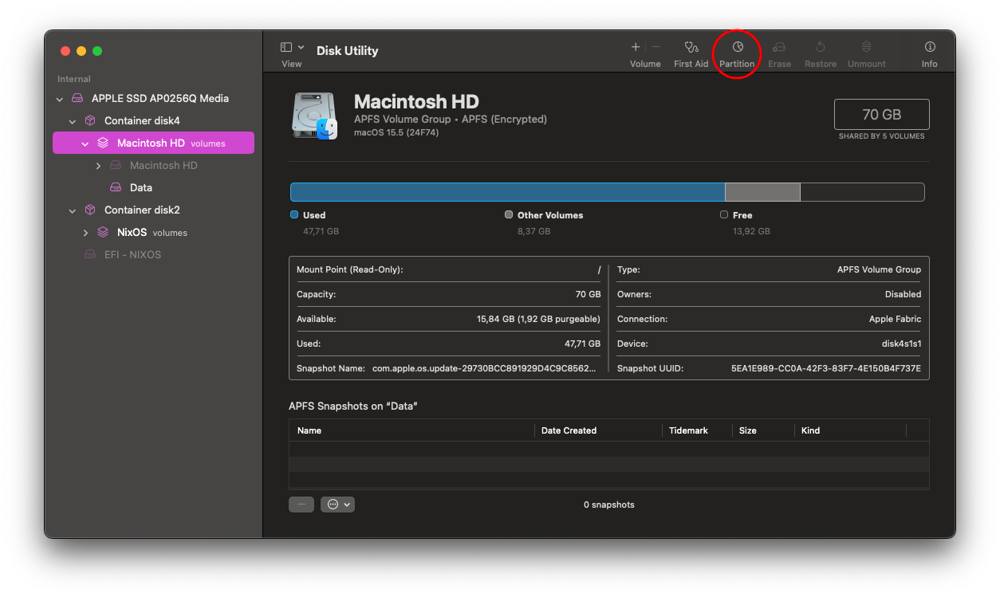
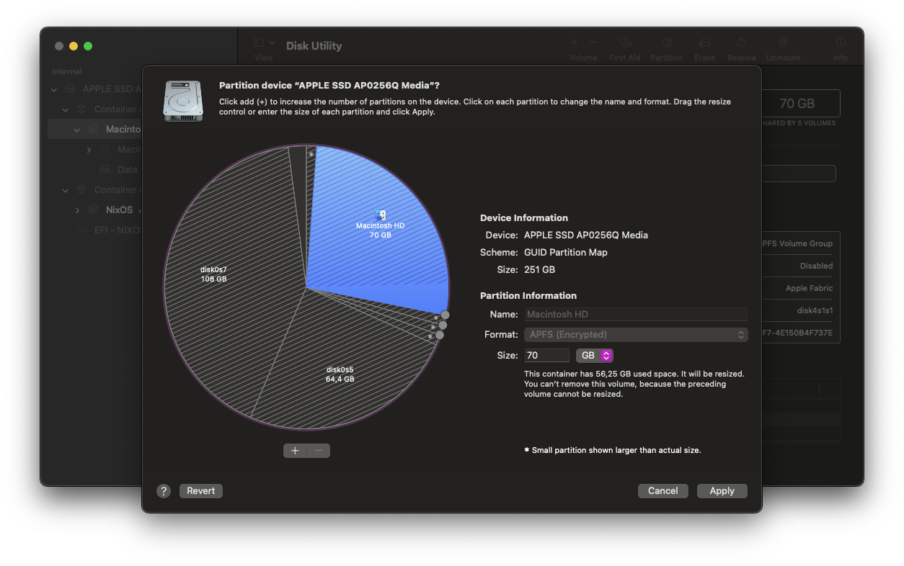

# ❄️ NixOS config

This configuration is based on [@SailorSnow's](https://github.com/SailorSnoW) config. He did an amazing job with it - thank you!

This repository contains my personal NixOS configuration, primarily targeting Apple Silicon via Asahi Linux. Home Manager is integrated directly into the NixOS builds.

I am using this configuration as my daily driver on a MacBook Air M1 (8GB RAM / 256GB Storage). It currently includes the experimental Asahi Linux branch with working external display support via USB-C.

This configuration uses ZFS as the root filesystem along with ZRAM. This setup is extremely helpful for devices with limited RAM and storage.

I will guide you through the entire installation process. Please note that these instructions **might not be complete**, as I wrote them from memory step-by-step and may have overlooked some details. If you encounter any issues, feel free to contact me on [Telegram](https://t.me/pengwius) or Matrix: `@pengwius:matrix.org`. I will be more than happy to help you and update the instructions.

—

# Installing

## 0. Shrinking the macOS Partition

If you no longer rely on macOS and want to shrink it as much as possible, use Disk Utility to do so manually. **Do not use the Asahi tool for this step**, as it reserves too much space for macOS and will not allow you to minimize the partition size fully.

<div style="display:flex; gap:10px; align-items:center; flex-wrap:wrap;">
  
  
</div>

## 1. Installing NixOS

Follow the steps provided here: https://github.com/nix-community/nixos-apple-silicon/blob/main/docs/uefi-standalone.md.

**However**, when creating the ext4 partition, only use **half** of the available free space. Leave the other half unallocated.

You could alternatively use the entire space and shrink the ext4 partition later, but this is unnecessary unless your disk space is so limited that it cannot handle the initial system build (including the kernel). You may want to run `nix-collect-garbage -d` in the future after the system builds to free up disk space.

## 2. Installing the Configuration

Clone my configuration into your user home directory:

```bash
git clone https://github.com/pengwius/nixos-config 
```

Replace `pengwius` with your username in the following files:
- `/flake.nix`
- `/home-manager/home.nix`
- `/hosts/asahi/configuration.nix`
- `/hosts/common/users.nix`
- `/modules/home-manager/gui/firefox.nix`

Update `fileSystems."/"` in `/hosts/asahi/hardware-configuration.nix` to:

```nix
fileSystems."/" = {
  device = "/dev/disk/by-uuid/<ext4 partition uuid>";
  fsType = "ext4";
};
```

Change the disk UUID in `fileSystems."/boot"` to match yours, and comment out `swapDevices` and `fileSystems."/home"`.

You can retrieve your UUID by running `lsblk -f` or `blkid`.

Now, rebuild your system by running:

```bash
sudo nixos-rebuild switch --flake .#asahi
```

This will likely take some time, as it needs to compile the entire kernel.
Once complete, set a password for your user:

```bash
passwd <your username>
```

Finally, reboot your system.

## 3. Creating the ZFS Partition

Now, create the ZFS partition in the free space you left in Step 1.

Run the following command:

```bash
sudo zpool create \
  -o ashift=12 \
  -O compression=zstd \
  -O atime=off \
  -O xattr=sa \
  -O acltype=posixacl \
  -O encryption=aes-256-gcm \
  -O keyformat=passphrase \
  -O keylocation=prompt \
  zroot /dev/<your free partition (likely nvme0n1p6, but verify this yourself!)>
```

You will be prompted to enter a password to encrypt the filesystem.

Next, create the ZFS datasets:

```bash
sudo zfs create zroot/nixos
sudo zfs create zroot/nixos/home
```

And set up the mountpoints:

```bash
sudo zfs set mountpoint=legacy zroot/nixos
sudo zfs set mountpoint=legacy zroot/nixos/home
```

## 4. Migrating the System from ext4 to ZFS

First, mount the ZFS partition:

```bash
sudo mount -t zfs zroot/nixos /mnt
```

Copy the entire system to ZFS:

```bash
sudo rsync -aAXHv --numeric-ids \
    --exclude={"/dev/*","/proc/*","/sys/*","/tmp/*","/run/*","/mnt/*","/media/*","/lost+found"} \
    / /mnt
```

Then copy the home directory:

```bash
sudo rsync -aAXHv /home/ /mnt/home
```

## 5. Configuring the System on ZFS

Chroot into the system on ZFS:

```bash
nixos-enter --root /mnt
```

Edit `/hosts/asahi/hardware-configuration.nix` in the config and update `fileSystems` to:

```nix
  fileSystems."/" = {
   device = "zroot/nixos";
   fsType = "zfs";
 };

 fileSystems."/home" = {
   device = "zroot/nixos/home";
   fsType = "zfs";
 };
```

Mount the EFI partition:

```bash
mount /dev/nvme0n1p4 (Check which partition holds YOUR EFI!) /boot
```

Proceed with the rebuild:

```bash
nixos-rebuild boot --flake .#asahi
```

After this, exit the chroot and reboot the system. It should boot into the ZFS installation.

## 6. Adding the ext4 Partition to the zpool

Once booted into your fresh ZFS system, you may want to add the remaining ext4 partition to the pool to utilize the full disk space. There is no need to resize partitions; you can simply wipe the ext4 partition and add it to the zpool.

Run:

```bash
sudo wipefs -a /dev/nvme0n1p5 (This might differ for you! Check carefully!)
```

And then:

```bash
sudo zpool add zroot /dev/nvme0n1p5
```

Verify that everything went correctly by running:

```bash
zpool list
zfs list
```

## 7. Adding Swap

To add swap, uncomment `swapDevices` in `/hosts/asahi/hardware-configuration.nix`, and create a ZFS Zvol for swap:

```bash
sudo zfs create -V 16G -b $(getconf PAGESIZE) -o compression=off -o logbias=throughput -o sync=always -o primarycache=metadata -o secondarycache=none zroot/swap
```

Format it as swap:

```bash
sudo mkswap /dev/zvol/zroot/swap
```

Enable it:

```bash
sudo swapon /dev/zvol/zroot/swap
```

Finally, rebuild the system:

```bash
sudo nixos-rebuild switch --flake .#asahi
```

Your NixOS Asahi setup on ZFS should now work perfectly!

—

## 🔧 Build, Test, Update

- Evaluate/check flake:
  ```bash
  nix flake check
  ```
- Build system closure (dry):
  ```bash
  nix build .#nixosConfigurations.asahi.config.system.build.toplevel
  ```
- Update inputs:
  ```bash
  nix flake update
  ```

—

## 🖥️ Host

- `asahi`: Asahi Linux on Apple Silicon (daily driver)

## 📦 Repository Structure

- `flake.nix`/`flake.lock`: Flake entry and locked inputs
- `hosts/`
  - `asahi/`: Host configuration (imports Apple Silicon support)
  - `common/`: Shared host glue (`boot.nix`, `locale.nix`, `desktop.nix`, `users.nix`)
- `home-manager/`: User config and assets; applied via system rebuilds
- `modules/`
  - `modules/nixos/`: Reusable NixOS modules (e.g., `netdata.nix`, `minecraft-server-*.nix`)
  - `modules/home-manager/`: Reusable HM modules (e.g., `zsh.nix`, `neovim/`, `gui/`)
- `overlays/`: Overlays including an `unstable` package set
- `pkgs/`: Custom packages (e.g., `tentrackule`)
- `dotfiles/`: Misc dotfiles not managed as HM modules

—

## 🧩 Notable Choices

- Wayland compositor: Niri (via `services.greetd` session)
- Stylix: Used for theming and fonts
- Podman: Enabled (Docker‑compat) with DNS for compose
- Bluetooth: Via BlueZ + Blueman
- Home Manager modules: Zsh, Neovim (nixCats), GUI apps (Firefox, Ghostty, etc.)

—

## ❄️ Notes

This is a personal setup tuned for my hardware and workflow. Feel free to explore and adapt it.
